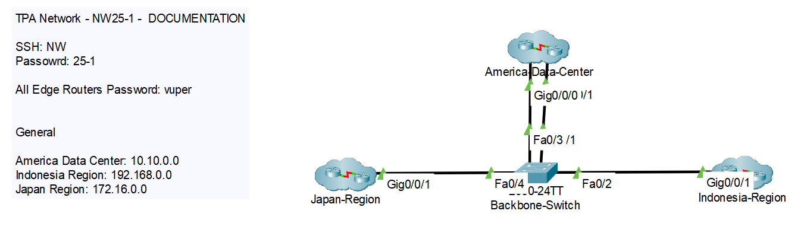
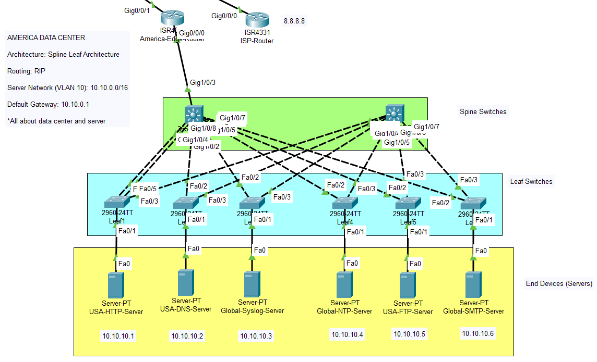
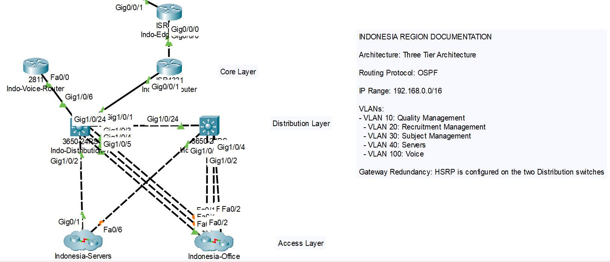
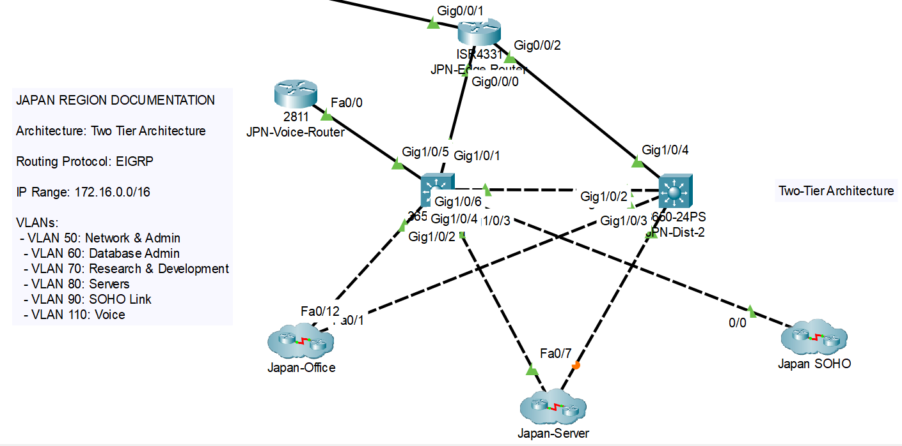

<h1 align="center"> IndiVUme </h1>

    

  <b>TPA Network Project (25-1)</b>
   
  Score: 28 / 30 (Duration: 2 Weeks)
   
  <b>IndiVUme</b> is a comprehensive <b>Network Infrastructure Prototype</b> designed for a rising global internet provider. Built using <b>Cisco Packet Tracer</b>, this project simulates a robust enterprise network connecting three major regions which are <b>Indonesia, Japan, and America</b> incorporating advanced routing protocols, redundancy, and server management to ensure seamless connectivity and high availability.

---

## 📃 Table of Contents
- [Introduction](#🌟-introduction)
- [Network Topology](#🛠️-network-topology-&-technologies)
- [Core Features](#🧩-core-features)
- [Project File](#🚀-project-file)
- [Getting Started Locally](#🧰-getting-started-locally)
- [Screenshots](#📸-network-preview)
- [Owner](#👥-owner)
- [Contact](#📬-contact)

---

## 🌟 Introduction

**IndiVUme** is designed to meet the rigorous demands of a modern ISP. The network architecture connects three distinct geographic regions, ensuring that employees, servers, and home users maintain secure and fast connectivity.

The project focuses on:
- **Inter-Region Connectivity:** Seamless communication between Indonesia, Japan, and America.
- **High Availability:** Redundancy implementation using EtherChannel and HSRP.
- **Security:** Strict Access Control Lists (ACLs), SSH management, and secure routing authentication.
- **Service Management:** Centralized DNS, HTTP, Email (SMTP), and IoT management.

> "Relentlessly Move Forward and Achieve our Dreams."

---

## 🛠️ Network Topology & Technologies

- **Simulator**: Cisco Packet Tracer 8.2+
- **WAN Routing**: BGP (Border Gateway Protocol) between Edge Routers
- **Internal Routing**: 
  - **OSPF** (Indonesia Region)
  - **EIGRP** (Japan Region)
  - **RIP** (America Data Center)
  - **Static Routing** (ISP Connection)
- **Switching**: VLANs, VTP, STP/Rapid-STP, EtherChannel
- **Redundancy**: HSRP (Hot Standby Router Protocol)
- **Security**: SSH, Port Security, PAT/NAT, Access Control Lists (ACL)
- **Management**: SNMP, Syslog, NTP

---

## 🧩 Core Features

### 🌎 **Global Architecture**
- **Edge Routers:** Configured with **BGP** for inter-region routing and **PAT** for internet access.
- **ISP Connection:** The America Edge Router connects to an ISP (8.8.8.8) via Static Routing, simulating real-world internet access.
- **Security:** All routers secured with encrypted passwords ("vuper") and SSH access.

---

### 🇺🇸 **America Data Center**
- **Architecture:** **Spine-Leaf Architecture** for high-bandwidth, low-latency server communication.
- **Server Farm:**
  - **DNS Server:** Resolves `indivume.com` (Landing Page).
  - **NTP Server:** Synchronizes time (Year 2030) across all global routers.
  - **Syslog Server:** Centralized logging for all Edge Routers.
  - **SMTP Server:** Handles `@indivume.com` email services.
  - **FTP Server:** Secured storage with specific user permissions.

---

### 🇮🇩 **Indonesia Region**
- **Routing:** managed via **OSPF** Area 0.
- **Architecture:** **Three-Tier Architecture** (Core, Distribution, Access).
- **Office Divisions (VLANs):**
  - Quality Management (IoT Integrated)
  - Recruitment Management
  - Subject Management (Wi-Fi SSID: `semangat`)
- **Services:**
  - **VoIP:** Inter-division calling configured.
  - **Local Servers:** DHCP, DNS (`vuper.com`), and local FTP restricted to Indonesia users via ACL.

---

### 🇯🇵 **Japan Region**
- **Routing:** managed via **EIGRP**.
- **Architecture:** Optimized Office Topology + **SOHO** (Small Office/Home Office) integration.
- **Office Divisions (VLANs):**
  - Network & Admin (IoT Integrated)
  - Database Admin
  - Research & Development (Wi-Fi SSID: `ganbare`)
- **Resilience:** Implements **Rapid STP** for fast convergence.
- **SOHO:** Connects a Home Router with wireless devices (Laptop, Smartphone, Printer) to the corporate network.

---

## 🚀 Project File
Download the completed `.pkt` file here:  
👉 [Download IndiVUme.pkt](https://github.com/StyNW7/TPA-IndiVUme/blob/main/TPAProject.pkt)

---

## 🧰 Getting Started Locally

### Prerequisites
- **Cisco Packet Tracer** (Version 8.2 or newer recommended)
- **User Profile Setup:**
  - When opening the file, ensure your User Profile matches the project configuration if prompted.

### Installation
1. Clone this repository or download the `.pkt` file.
2. Open **Cisco Packet Tracer**.
3. File > Open > Select `TPAProject.pkt`.
4. Allow the network to converge (Fast Forward Time if necessary).

---

## 📸 Network Preview
<table style="width:100%; text-align:center">
    <col width="100%">
    <tr>
        <td width="1%" align="center"></td>
    </tr>
    <tr>
        <td width="1%" align="center"><b>Full Global Topology</b></td>
    </tr>
    <tr>
        <td width="1%" align="center"></td>
    </tr>
    <tr>
        <td width="1%" align="center">America Data Center (Spine-Leaf-Arch)</td>
    </tr>
    <tr>
        <td width="1%" align="center"></td>
    </tr>
    <tr>
        <td width="1%" align="center">Indonesia Region (3-Tier Arch)</td>
    </tr>
    <tr>
        <td width="1%" align="center"></td>
    </tr>
    <tr>
        <td width="1%" align="center">Japan Region (2-Tier Arch)</td>
    </tr>
</table>

---

## 👥 Owner

This Project is created by:
- **Stanley Nathanael Wijaya (NW25-1)**

---

## 📬 Contact
Have questions about anything?

- 📧 Email: stanley.n.wijaya7@gmail.com
- 💬 Discord: `stynw7`

<code> "Death is better than an unbeautiful life" </code>